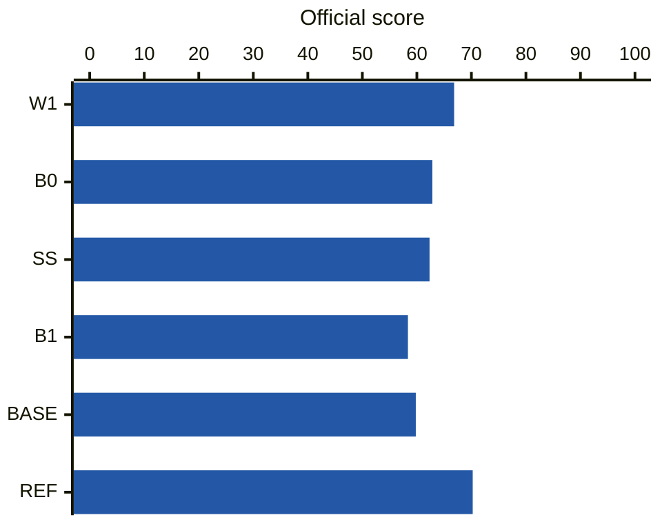

# ASD experiments — Zenn連載の実験入口

Zennの異常音検知（ASD）連載に対応する実験コードとNotebookです。手法・結果・解説を以下の表から参照できます。

<!-- experiments:start -->

## 手法

### DCASE 2026 Evaluation / BEATs_iter3

[Notebook](notebooks/02_b0_b1_w1_ss.ipynb)

| 手法 | 特徴 | 特徴抽出モデル | モデルの追加学習 | 参考文献 |
|---|---|---|---|---|
| B0 | 近接マイク | BEATs_iter3 | なし（重み固定） | — |
| B1 | 遠方マイク | BEATs_iter3 | なし（重み固定） | — |
| W1 | 振幅と位相を合わせて減算 | BEATs_iter3 | なし（重み固定） | [Ozeki技術報告](https://dcase.community/documents/challenge2026/technical_reports/DCASE2026_Ozeki_101_t2.pdf)（同形の減算） |
| SS | 振幅スペクトル減算 | BEATs_iter3 | なし（重み固定） | [Chu・Qian技術報告](https://dcase.community/documents/challenge2026/technical_reports/DCASE2026_Qian_65_t2.pdf)（式1） |

#### 公式ベースライン・参考システム

| 記号 | 役割 | システム | 参考文献 |
|---|---|---|---|
| BASE | 公式ベースライン | DCASE2026_baseline_task2_MSE | — |
| REF | 一部処理の参考元 | Fujimura_MERL_task2_3 | [NA-SSL論文](https://arxiv.org/html/2608.00447v1) |

本実験はBEATs_iter3を使用。REFはNA-BEATsを使うシステムで、RDPなど一部の処理を参考にしています。

## スコア

総合スコアは高いほど良く、本実験の手法はスコア順に並べています。

### DCASE 2026 Evaluation / BEATs_iter3

[固定条件](docs/02-protocol.md) · [入力取得](docs/02-inputs.md) · [総合値](results/02-summary.csv)

青：本実験／灰：公式・参考値（異なるモデル）。

出典: [DCASE 2026 Task 2 Results](https://dcase.community/challenge2026/task-first-shot-unsupervised-anomalous-sound-detection-for-machine-condition-monitoring-results) · [システム名・参考値](results/02-challenge-references.json)

<!-- experiments:end -->

## 使い方と資料

| 調べたいこと | 入口 |
|---|---|
| 計算の仕組み | [実装案内](src/asd_min/README.md) |
| CLIの実行・再採点 | [runner解説](src/asd_min/runner.md#cliを使う) |
| コードの由来と利用条件 | [出典と利用条件](docs/rights.md)・[第三者通知](THIRD_PARTY_NOTICES.md) |
| 確認した範囲 | [検証範囲](VALIDATION.md) |

データ・重み・評価器・正解CSVは同梱していません。配布元から取得し、そのパスを指定します。ライセンスと出典は[出典と利用条件](docs/rights.md)を参照してください。

一覧とグラフの更新: [手法一覧](configs/readme-methods.csv)に特徴抽出モデル・モデルの追加学習を含む行を追加し、保存結果CSVと固定条件・入力取得・Notebookを指定して `python scripts/update_readme.py` を実行します。同じ比較範囲では同じ結果CSV・固定条件・入力取得を指定し、結果CSVにもスコア行を追加します。異なる比較条件には別の `comparison` を付けます。
手法のコードと解説は同じ階層に置き、[実装案内](src/asd_min/README.md)へ行を追加します。各回の設定・結果・Notebookはその回の資料として保持し、検証記録は[検証範囲](VALIDATION.md)へ追加します。
