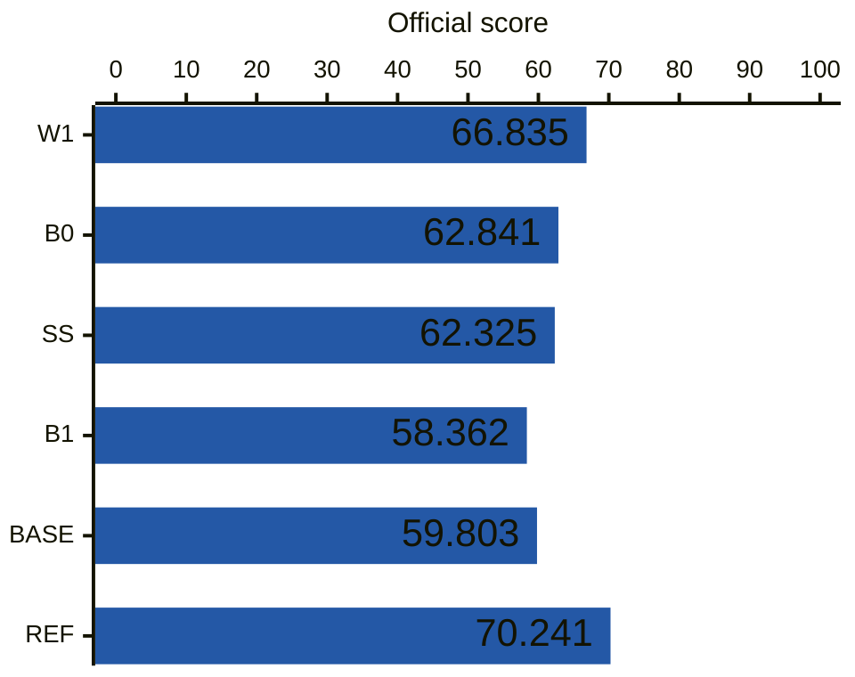
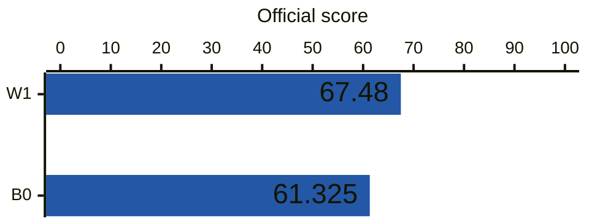
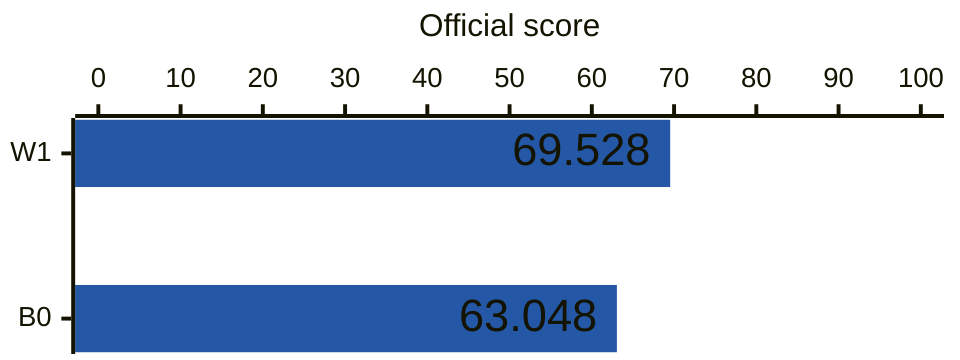
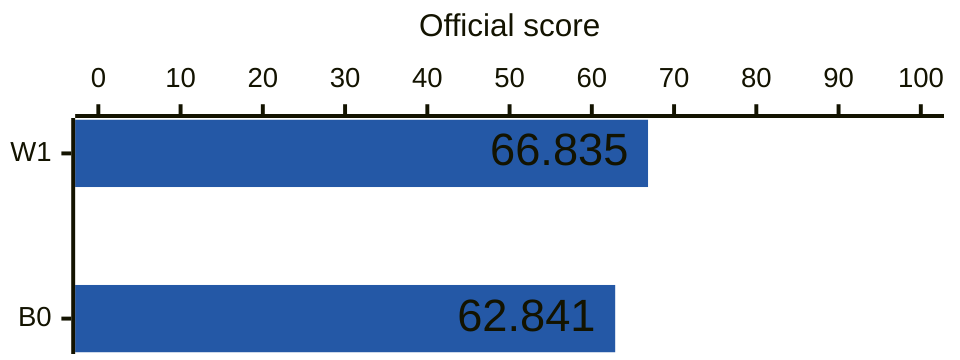
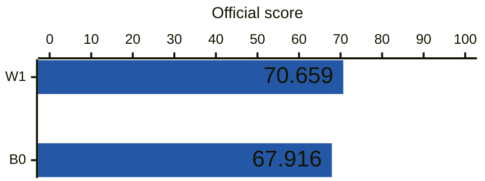

# ASD experiments — Zenn連載の実験入口

Zennの異常音検知（ASD）連載に対応する実験コードとmarimoアプリです。[アプリ一覧を開く](https://kasahart.github.io/asd-experiments/)。インストールやデータ取得は不要です。手法・結果・解説を以下の表から参照できます。

<!-- experiments:start -->

## 手法

### DCASE 2026 Evaluation / BEATs_iter3

[marimoアプリ](apps/02_b0_b1_w1_ss.py)

| 手法 | 特徴 | 特徴抽出モデル | モデルの追加学習 | 参考文献 |
|---|---|---|---|---|
| B0 | 近接マイク | BEATs_iter3 | なし（重み固定） | — |
| B1 | 遠方マイク | BEATs_iter3 | なし（重み固定） | — |
| W1 | 振幅と位相を合わせて減算 | BEATs_iter3 | なし（重み固定） | [Ozeki技術報告](https://dcase.community/documents/challenge2026/technical_reports/DCASE2026_Ozeki_101_t2.pdf)（同形の減算） |
| SS | 振幅スペクトル減算 | BEATs_iter3 | なし（重み固定） | [Chu・Qian技術報告](https://dcase.community/documents/challenge2026/technical_reports/DCASE2026_Qian_65_t2.pdf)（式1） |

#### 公式ベースライン・参考システム

| 記号 | 役割 | システム | 参考文献 |
|---|---|---|---|
| BASE | 公式ベースライン | DCASE2026_baseline_task2_MSE | — |
| REF | 一部処理の参考元 | Fujimura_MERL_task2_3 | [NA-SSL論文](https://arxiv.org/html/2608.00447v1) |

本実験はBEATs_iter3を使用。REFはNA-BEATsを使うシステムで、RDPなど一部の処理を参考にしています。

### DCASE 2026 Development / 固定BEATs（第3回）

| 手法 | 特徴 | 特徴抽出モデル | モデルの追加学習 | 参考文献 |
|---|---|---|---|---|
| B0 | 近接マイク | BEATs_iter3 | なし（重み固定） | — |
| W1 | 全区間の複素線形減算 | BEATs_iter3 | なし（重み固定） | — |

### DCASE 2026 Development / BEATs追加学習（第3回）

| 手法 | 特徴 | 特徴抽出モデル | モデルの追加学習 | 参考文献 |
|---|---|---|---|---|
| B0 | 近接マイク | BEATs_iter3 + LoRA | 正常12,000音・25epoch | — |
| W1 | 全区間の複素線形減算 | BEATs_iter3 + LoRA | 正常12,000音・25epoch | — |

### DCASE 2026 Evaluation / 固定BEATs（第3回）

| 手法 | 特徴 | 特徴抽出モデル | モデルの追加学習 | 参考文献 |
|---|---|---|---|---|
| B0 | 近接マイク | BEATs_iter3 | なし（重み固定） | — |
| W1 | 全区間の複素線形減算 | BEATs_iter3 | なし（重み固定） | — |

### DCASE 2026 Evaluation / BEATs追加学習（第3回）

| 手法 | 特徴 | 特徴抽出モデル | モデルの追加学習 | 参考文献 |
|---|---|---|---|---|
| B0 | 近接マイク | BEATs_iter3 + LoRA | 正常12,000音・25epoch | — |
| W1 | 全区間の複素線形減算 | BEATs_iter3 + LoRA | 正常12,000音・25epoch | — |

## スコア

総合スコアは高いほど良く、本実験の手法はスコア順に並べています。

### DCASE 2026 Evaluation / BEATs_iter3

[固定条件](docs/02-protocol.md) · [入力取得](docs/02-inputs.md) · [総合値](results/02-summary.csv)

青：本実験／灰：公式・参考値（異なるモデル）。



出典: [DCASE 2026 Task 2 Results](https://dcase.community/challenge2026/task-first-shot-unsupervised-anomalous-sound-detection-for-machine-condition-monitoring-results) · [システム名・参考値](results/02-challenge-references.json)

### DCASE 2026 Development / 固定BEATs（第3回）

[固定条件](reproduction/asd03/README.md#入力と固定条件) · [入力取得](reproduction/asd03/README.md#入力の取得と配置) · [総合値](results/03-beats/summary.csv)

青：本実験。



### DCASE 2026 Development / BEATs追加学習（第3回）

[固定条件](reproduction/asd03/README.md#入力と固定条件) · [入力取得](reproduction/asd03/README.md#入力の取得と配置) · [総合値](results/03-beats/summary.csv)

青：本実験。



### DCASE 2026 Evaluation / 固定BEATs（第3回）

[固定条件](reproduction/asd03/README.md#入力と固定条件) · [入力取得](reproduction/asd03/README.md#入力の取得と配置) · [総合値](results/03-beats/summary.csv)

青：本実験。



### DCASE 2026 Evaluation / BEATs追加学習（第3回）

[固定条件](reproduction/asd03/README.md#入力と固定条件) · [入力取得](reproduction/asd03/README.md#入力の取得と配置) · [総合値](results/03-beats/summary.csv)

青：本実験。



<!-- experiments:end -->

## 実行環境

依存関係は[pyproject.toml](pyproject.toml)で管理します。共通の`.venv`を使い、推論は基本依存、学習は`training`、アプリは`app`、表示は`visualization`、公式評価器の実行依存は`evaluation`、テストは`test`を追加します。学習にはPython3.11を使います。

```bash
python3.11 -m venv .venv
.venv/bin/python -m pip install torch==2.7.1 torchaudio==2.7.1 torchvision==0.22.1 --index-url https://download.pytorch.org/whl/cu128
.venv/bin/python -m pip install -e '.[training,app,visualization,evaluation,test]'
.venv/bin/python reproduction/asd03/runtime.py install
.venv/bin/python -m pip check
```

CPU環境は上のPyTorch配布先を`https://download.pytorch.org/whl/cpu`に変更します。[公式PyTorch 2.7.1構成](https://pytorch.org/get-started/previous-versions/)に合わせ、Torch・TorchAudio・TorchVisionを同じ配布先から導入します。推論だけなら`pip install -e .`で導入できます。最後の`runtime.py install`は[固定ASDKit archive](reproduction/asd03/upstream.lock.json)を仮想環境内へ取得してeditable導入する処理です。upstreamの必須モジュールがwheelに含まれないため、この方式を使い、Git・clone・checkout操作を不要にしています。

## 使い方と資料

| 調べたいこと | 入口 |
|---|---|
| 計算の仕組み | [実装案内](src/asd_min/README.md) |
| CLIの実行・再採点 | [runner解説](src/asd_min/runner.md#cliを使う) |
| コードの由来と利用条件 | [出典と利用条件](docs/rights.md)・[第三者通知](THIRD_PARTY_NOTICES.md) |

リポジトリに含まれる音声データ（marimoアプリ内の埋め込み音声を含む）の出典・利用条件は、[帰属情報](docs/DATA_ATTRIBUTION.md)を参照してください。データセット全体・重み・評価器・正解CSVは同梱していません。

一覧とグラフの更新: [手法一覧](configs/readme-methods.csv)に特徴抽出モデル・モデルの追加学習を含む行を追加し、保存結果CSVと固定条件・入力取得・marimoアプリを指定して `python scripts/update_readme.py` を実行します。同じ比較範囲では同じ結果CSV・固定条件・入力取得を指定し、結果CSVにもスコア行を追加します。異なる比較条件には別の `comparison` を付けます。
手法のコードと解説は同じ階層に置き、[実装案内](src/asd_min/README.md)へ行を追加します。各回の設定・結果・marimoアプリはその回の資料として保持します。
